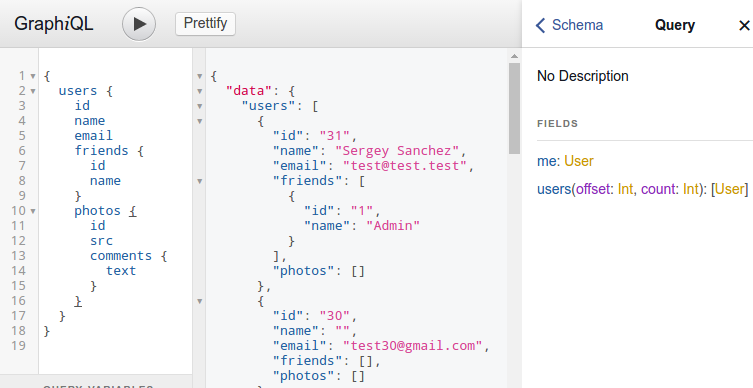

# GraphiQL PSR-7 Middleware

You can add a [GraphiQL](https://github.com/graphql/graphiql) interface to your project with this PSR-7 Middleware

[](http://graphql.org/swapi-graphql)

## Install
```
composer require rromanovsky/graphiql-middleware
```

## Usage
- Slim
    ```php
    use GraphiQLMiddleware\GraphiQLMiddleware;
    // By default the middleware will be executed on '/graphiql' route
    $app->add(new GraphiQLMiddleware());
    ```